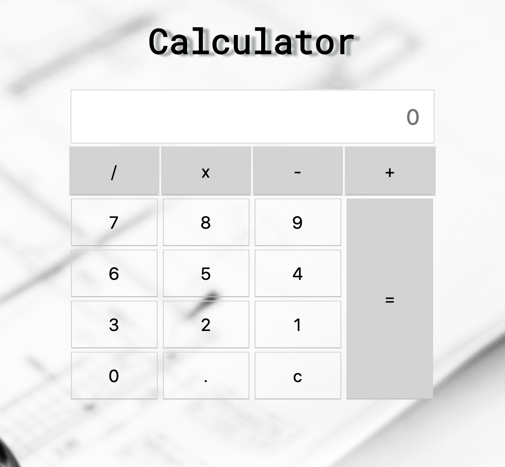

Calculator
=========

# Introduction

Calculator HTML + CSS + JS

# Functional description




# Technical description

```javascript
function calculator() {
    let display = document.getElementById('display').value;
    let result = eval(display);
    isNaN(eval(display)) ? document.getElementById('display').value = 'undefined' : document.getElementById('display').value = result;
}

```# project-calculator
